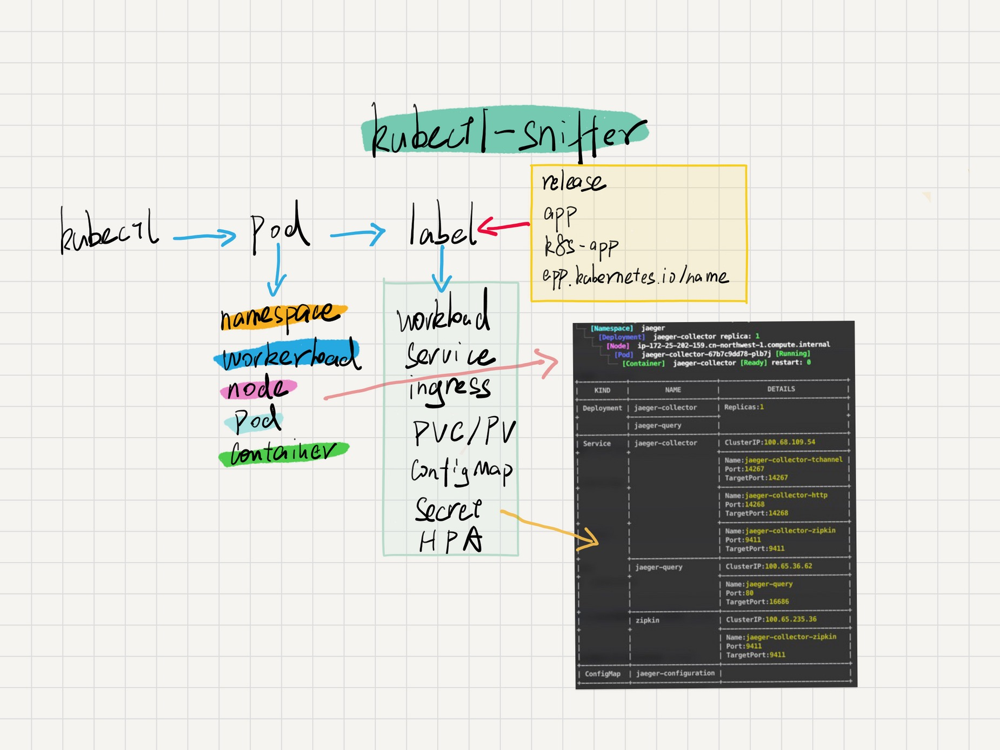

# Kubectl Sniffer

[](https://goreportcard.com/report/github.com/sunny0826/kubectl-sniffer)

[](https://github.com/sunny0826/kubectl-sniffer/releases)


`kubectl-sniffer` is a [kubectl plugin](https://kubernetes.io/docs/tasks/extend-kubectl/kubectl-plugins/) that show pod-related resource information.

The plugin can display pod-related:
* Workloads(Deployment,StatefulSet,DaemonSet)
* Namespace
* Node
* Service
* Ingress
* ConfigMap
* Secret
* HPA

## Requirements

- Kubernetes 1.10.0+
- Kubectl 1.13.0+
- Krew 0.4.0+

## Installation

```shell
kubectl krew install sniffer
```

## Example

```bash
$ kubectl sniffer thanos-query-9fbb8c4bc-5x2zf
└─┬ [Namespace]  kube-system
  └─┬ [Deployment]  thanos-query replica: 2
    └─┬ [Node]  ip-172-25-204-130.cn-northwest-1.compute.internal
      └─┬ [Pod]  thanos-query-9fbb8c4bc-5x2zf [Running]
        └── [Container]  thanos-query [Ready] restart: 0

+------------+------------------------------------------+---------------------------------------+
|    KIND    |                   NAME                   |                DETAILS                |
+------------+------------------------------------------+---------------------------------------+
| Deployment | thanos-bucket                            | Replicas:1                            |
+            +------------------------------------------+                                       +
|            | thanos-compact                           |                                       |
+            +------------------------------------------+---------------------------------------+
|            | thanos-query                             | Replicas:2                            |
+            +------------------------------------------+---------------------------------------+
|            | thanos-store-0                           | Replicas:1                            |
+------------+------------------------------------------+---------------------------------------+
| Service    | thanos-bucket                            | ClusterIP:100.71.173.222              |
+            +                                          +---------------------------------------+
|            |                                          | Name:http                             |
|            |                                          | Port:8080                             |
|            |                                          | TargetPort:http                       |
+            +------------------------------------------+---------------------------------------+
|            | thanos-query-http                        | ClusterIP:100.71.18.91                |
+            +                                          +---------------------------------------+
|            |                                          | Name:http                             |
|            |                                          | Port:10902                            |
|            |                                          | TargetPort:http                       |
+------------+------------------------------------------+---------------------------------------+
| Ingress    | thanos-query-http                        | Url:https://xxxx.sniffer.io/          |
+            +                                          +---------------------------------------+
|            |                                          | Backend:thanos-query-http             |
+            +                                          +---------------------------------------+
|            |                                          | Url:https://thanos.xxxx.sniffer.io/   |
+            +                                          +---------------------------------------+
|            |                                          | Backend:thanos-query-http             |
+            +                                          +---------------------------------------+
|            |                                          | LoadBalanceIP:                        |
|            |                                          | 172.25.200.106                        |
|            |                                          | 172.25.202.93                         |
|            |                                          | 172.25.202.98                         |
|            |                                          | 172.25.204.214                        |
+------------+------------------------------------------+---------------------------------------+
| PVC        | compact-data-volume                      | StorageClass:gp2                      |
+            +                                          +---------------------------------------+
|            |                                          | AccessModes:ReadWriteOnce             |
+            +                                          +---------------------------------------+
|            |                                          | Size:200Gi                            |
+------------+------------------------------------------+---------------------------------------+
| PV         | pvc-287a9257-9fca-40ed-808d-277ac796597c |                                       |
+------------+------------------------------------------+---------------------------------------+
```

## Reference

- [Kubectl Plugins](https://kubernetes.io/docs/tasks/extend-kubectl/kubectl-plugins/)
- [Krew](https://krew.sigs.k8s.io/)

## Design

