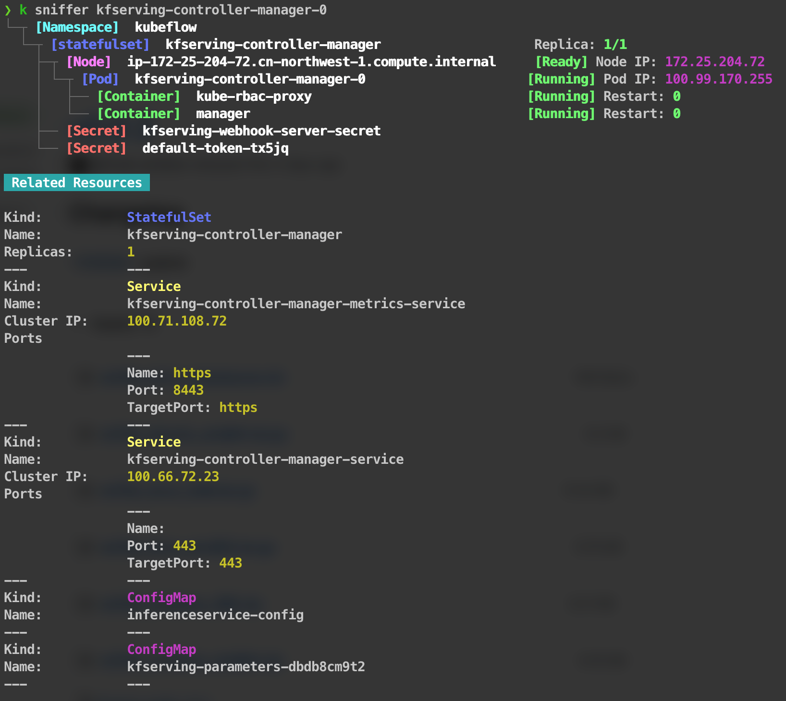
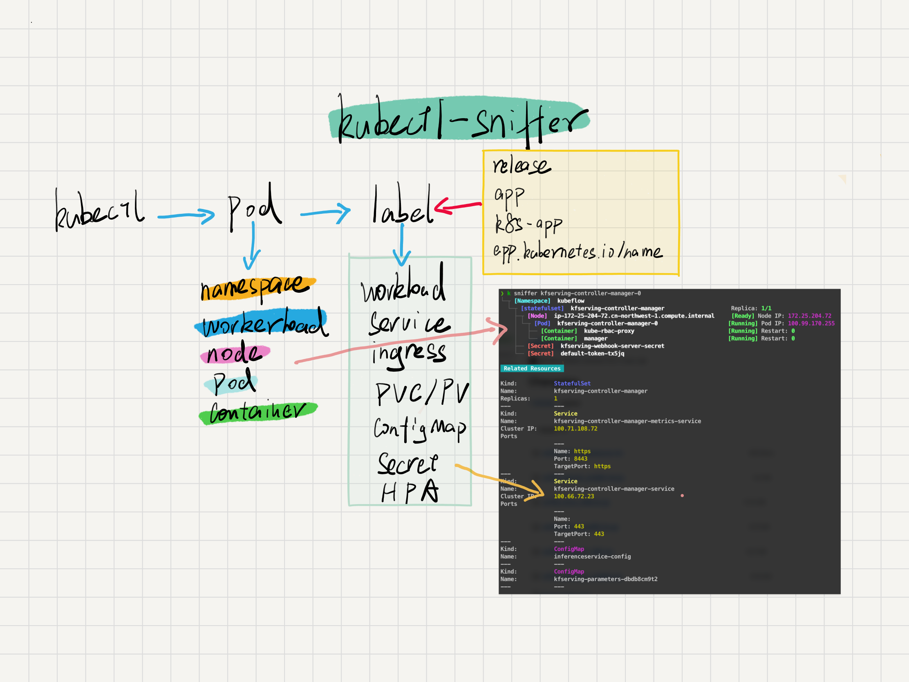

# Kubectl Pod Lens

[](https://goreportcard.com/report/github.com/sunny0826/kubectl-sniffer)

[](https://github.com/sunny0826/kubectl-sniffer/releases)

<p align="center">
    
</p>
`kubectl-pod-lens` is a [kubectl plugin](https://kubernetes.io/docs/tasks/extend-kubectl/kubectl-plugins/) that show pod-related resource information.

The plugin can display pod-related:
* Workloads(Deployment,StatefulSet,DaemonSet)
* Namespace
* Node
* Service
* Ingress
* ConfigMap
* Secret
* HPA

## Requirements

- Kubernetes 1.10.0+
- Kubectl 1.13.0+
- Krew 0.4.0+

## Installation

```shell
$ kubectl krew install pod-lens
```

## Example



## Reference

- [Kubectl Plugins](https://kubernetes.io/docs/tasks/extend-kubectl/kubectl-plugins/)
- [Krew](https://krew.sigs.k8s.io/)

## Design

